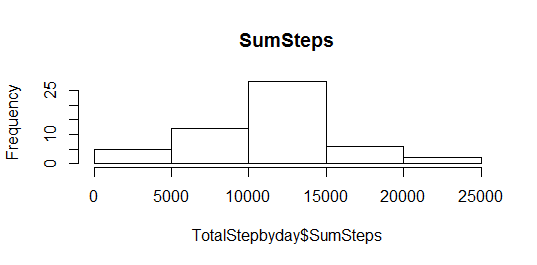
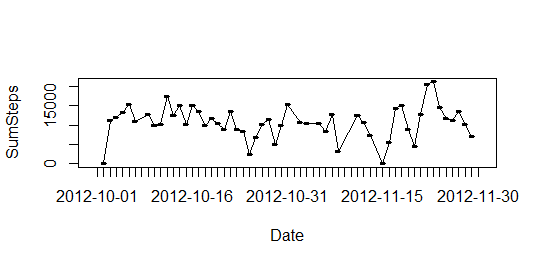
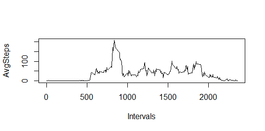
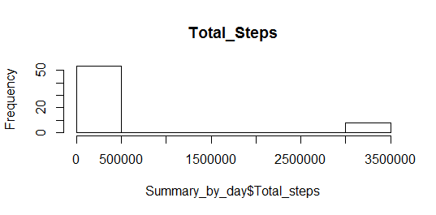
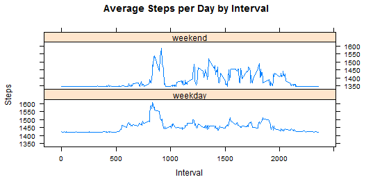

Reproducible Research: Peer Assessment 1
by Ricardo Lanza
github repo with RMarkdown source code: https://github.com/Rickhyl/RepData_PeerAssessment1


## Loading and preprocessing the data
```{r}
activity <- read.csv("~/Week 3/repdata-data-activity/activity.csv")
attach(activity)
Activity<-activity[complete.cases(activity),]
```

## What is mean total number of steps taken per day?
```{r}
TotalStepbyday<-aggregate(Activity$steps, by= list(Activity$date), FUN=sum)
names(TotalStepbyday)<-c("Date","SumSteps")
attach(TotalStepbyday)
hist(TotalStepbyday$SumSteps, main="SumSteps")
```

```{r}
Mean_step_byday<-mean(SumSteps)
Meadian<-median(SumSteps)
plot(TotalStepbyday,type="l")
lines(TotalStepbyday)
```

## What is the average daily activity pattern?
```{r}
AvgStepbyInterval<-aggregate(Activity$steps, by= list(Activity$interval), FUN=mean)
names(AvgStepbyInterval)<-c("Intervals","AvgSteps")
attach(AvgStepbyInterval)
plot(AvgStepbyInterval,type="l")
subset(AvgStepbyInterval,AvgSteps==max(AvgStepbyInterval$AvgSteps))
```

## Imputing missing values
```{r}
Count_NA_values<-sum(is.na(activity))
Count_NA_values
Activity_WO_NAvalues<-activity
Activity_WO_NAvalues[is.na(Activity_WO_NAvalues)]<-Mean_step_byday
Summary_by_day<-aggregate(Activity_WO_NAvalues$steps, by= list(Activity_WO_NAvalues$date), FUN=sum)
names(Summary_by_day)<-c("Date","Total_steps")
hist(Summary_by_day$Total_steps, main="Total_Steps")^
```

```{r}
Summary_by_day_mean<-aggregate(Activity_WO_NAvalues$steps, by= list(Activity_WO_NAvalues$date), FUN=mean)
Summary_by_day_median<-aggregate(Activity_WO_NAvalues$steps, by= list(Activity_WO_NAvalues$date), FUN=median)
```

## Are there differences in activity patterns between weekdays and weekends?
```{r}
Activity_WO_NAvalues$weekday<-strftime(activity$date,"%w")
is.weekend<-function(x){if(x>5)y<-"weekend" else {"weekday"}}
Activity_WO_NAvalues$weekday<-sapply(Activity_WO_NAvalues$weekday,is.weekend)
install.packages("lattice")
library("lattice")
AvgStepbyInterval_2<-aggregate(steps~interval+weekday,Activity_WO_NAvalues,mean)
xyplot(AvgStepbyInterval_2$steps~AvgStepbyInterval_2$interval|AvgStepbyInterval_2$weekday,main="Average Steps per Day by Interval",xlab="Interval", ylab="Steps",layout=c(1,2),type="l")
```

